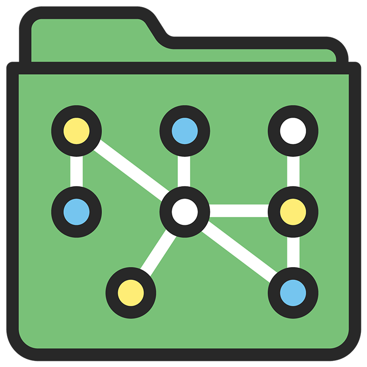

# pnpm-workspace-graph

Visualize project relationships in your [PNPM](https://pnpm.io/) workspace

## Quick start

1. Install the tool:

   ```shell
   # Install the tool globally so that you can invoke it in any folder:
   $ pnpm install --global pnpm-workspace-graph
   ```

2. Invoke the tool:

   If your monorepo is using a regular [PNPM workspace](https://pnpm.io/workspaces):

   ```shell
   # This is the folder where you cloned your repo:
   $ cd my-pnpm-monorepo

   # Launch the app in your web browser
   $ pnpm-workspace-graph

   pnpm-workspace-graph is started at http://127.0.0.1:8188
   Use Ctrl+C to close it
   ```

   If your monorepo is using a [Rush workspace for PNPM](https://rushjs.io/pages/maintainer/package_managers/):

   ```shell
   # This is the folder where you cloned your repo:
   $ cd my-rush-monorepo

   # Rush's pnpm-workspace.yaml is located in the "common/temp" folder.
   # Run "rush install" to ensure it has been generated and is up to date.
   #
   # IMPORTANT: Your rush.json config file must specify useWorkspaces=true
   $ rush install

   # Launch the app in your web browser, specifying to use "common/temp"
   $ pnpm-workspace-graph --cwd common/temp

   pnpm-workspace-graph is started at http://127.0.0.1:8188
   Use Ctrl+C to close it
   ```

3. When the app page appears in your web browser appears, click the `Filter` button:

   <kbd></kbd>
   <p align="center"><i>Using the Settings Panel to select a subset of projects</i></p>

   A typical monorepo will have too many projects to be meaningfully visualized.  The app allows you to use PNPM's `--filter` syntax to select a subset of projects that you are interested in visualizing.  In separate input boxes, enter the names of the projects to be included in the view.  They must be workspace projects referenced by `pnpm-workspace.yaml`. Specify the full name as it appears in the **package.json** `"name"` field.

   To include all workspace projects that are dependencies of `my-package`, specify: `...my-package`

   To indicate all workspace projects that depend on `my-package`, specify: `my-package...`

   Refer to the [PNPM documentation](https://pnpm.io/filtering) for more information about the `--filter` syntax.

4. After you have selected a subset of projects, click the `[X]` to close the Settings Panel.  Using the mouse, you can move the nodes to make a nice arrangement. Use the mouse wheel to zoom in or out.

   <kbd></kbd>
   <p align="center"><i>An example graph made by cloning the <a href="https://github.com/pnpm/pnpm">https://github.com/pnpm/pnpm</a> workspace</i></p>


## Features

1. Layout the graph with different directions: Top to Bottom or Left to Right.

Top to Bottom              |  Left to Right
:-------------------------:|:-------------------------:
<kbd></kbd>  | <kbd></kbd>

2. Save the graph to PNG for later use.

<kbd></kbd>

## CLI parameters

```shell
$ pnpm-workspace-graph --help

Usage: pnpm-workspace-graph [options]

Options:
  -V, --version      output the version number
  -C, --cwd <cwd>    working directory
  -h, --host <host>  host (default: "127.0.0.1")
  -p, --port <port>  port (default: 8188)
  -o, --open         open browser (default: true)
  --help             display help for command
```

### `-C, --cwd`

Default: `process.cwd()`

Specify working directory. This directory must contain the `pnpm-workspace.yaml` file that defines your workspace.

### `-h, --host`

Default: `127.0.0.1`

Specify network interface where the local web server will run.

### `-p --port`

Default: `8188`

Specify the localhost port where the local web server will run.

NOTE: If you want to invoke multiple instances of the tool, you must specify different ports.  This will be improved in the future.

### `-o --open`

Default: `true`

Whether to launch the web browser automatically to show the specified host/port.


## Contributing

To build and debug the project:

```shell
$ git clone https://github.com/chengcyber/pnpm-workspace-graph.git
$ cd pnpm-workspace-graph

# Install dependencies
$ pnpm install

# Launch the Webpack localhost dev server
$ pnpm dev:client

# (In a separate shell window)
# Launch the TypeScript compiler in "watch mode"
$ pnpm dev  # in another shell

# (In a separate shell window)
# Invoke the CLI tool using the "fixture/basic" testing workspace
$ node lib/cli.js -C fixture/basic
```

## LICENSE

MIT @[chengcyber](https://github.com/chengcyber)
